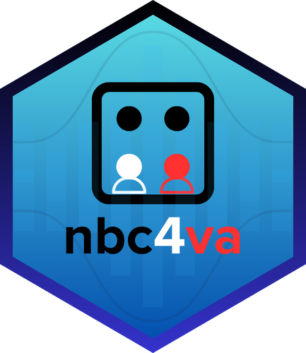
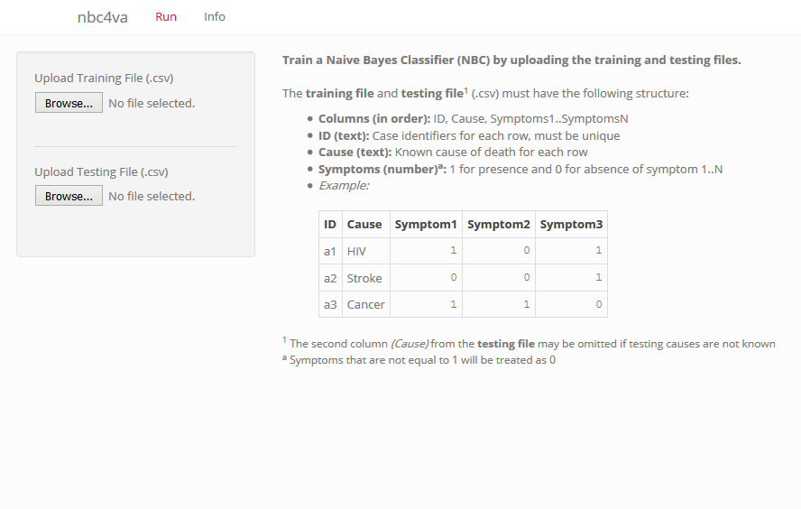

# nbc4va: Bayes Classifier for Verbal Autopsy Data <a href="https://rrwen.github.io/nbc4va"></a>

<!-- badges: start -->
[](https://cran.r-project.org/package=nbc4va)
[](https://cran.r-project.org/package=nbc4va)
<!-- badges: end -->

## Overview

An implementation of the Naive Bayes Classifier (NBC) algorithm used for Verbal Autopsy (VA) built on code from [Miasnikof et al (2015)](https://bmcmedicine.biomedcentral.com/articles/10.1186/s12916-015-0521-2).

* [Documentation](https://rrwen.github.io/nbc4va)
* [Changes](NEWS.md)

## Installation

1. Install [R](https://www.r-project.org/)
2. Install the [RStudio](https://www.rstudio.com/products/rstudio/download/#download) code editor
3. Open an [R Console](https://support.rstudio.com/hc/en-us/articles/200404846-Working-in-the-Console) in RStudio
3. Install [nbc4va](https://github.com/rrwen/nbc4va) in an R console with [install.packages](https://www.rdocumentation.org/packages/utils/versions/3.5.1/topics/install.packages)

```R
install.packages("nbc4va")
```

## Usage

1. Load [nbc4va](https://github.com/rrwen/nbc4va) with [library](https://www.rdocumentation.org/packages/base/versions/3.5.1/topics/library)
2. Open the Graphical User Interface (GUI) and follow the instructions

```R
library(nbc4va)
nbc4vaGUI()
```



For programmatic usage, see [Advanced Usage](https://rrwen.github.io/nbc4va/advanced-usage.html).

## Acknowledgements

This package was developed at the Centre for Global Health Research (CGHR) in Toronto, Ontario, Canada. The original NBC algorithm code was developed by Pierre Miaskinof and Vasily Giannakeas. The original performance metrics code was provided by Dr. Mireille Gomes whom also offered guidance in metrics implementation and user testing. Special thanks to Richard Zehang Li for providing a standard structure for the package and Patrycja Kolpak for user testing of the Graphical User Interface (GUI).

## Contact

Richard Wen <rrwen.dev@gmail.com>
